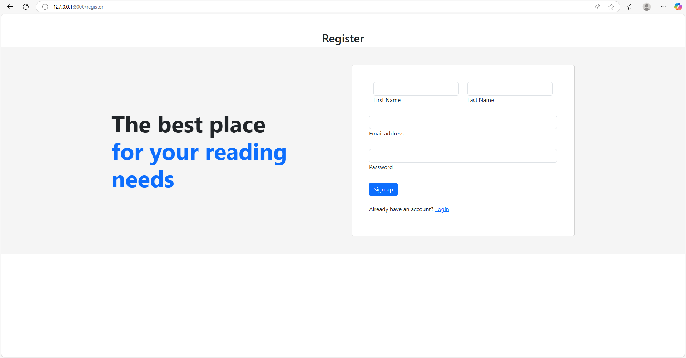
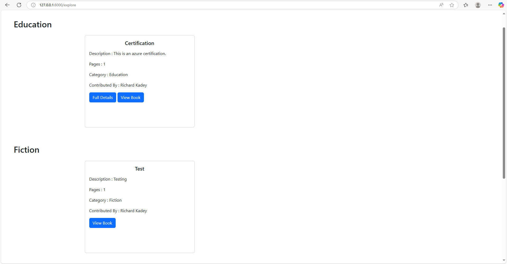

# E-Library Django App
E-Library is a web-based application built with Django that allows users to manage a digital library by storing, organizing, and accessing books. Whether you are creating a personal book archive or managing a shared repository for an organization, E-Library provides a simple and intuitive interface for digital library management.

### 🔹 Login Page


### 🔹 Home Page


### 🔹 Book Detail


## 🚀 Features

- 📖 Upload and store digital books (PDF, EPUB, etc.)
- 🗂️ Organize books by category, author, and tags
- 🔍 Search functionality to find books quickly
- 🧾 Book details page with description, publication date, and file download
- 👤 User authentication (login/register/logout)
- 🛡️ Admin dashboard for managing books and users

## 🛠️ Tech Stack

- **Framework**: Django (Python)
- **Database**: SQLite (default, can be replaced with PostgreSQL/MySQL)
- **Frontend**: HTML, CSS, Bootstrap
- **Authentication**: Django's built-in auth system
- **File Handling**: Django FileField for book uploads

## 📦 Installation

### Prerequisites

- Python 3.8+
- pip (Python package manager)
- Virtualenv (recommended)


### Setup

1. **Clone the repository:**

   ```bash
   git clone <url>
   cd e-library
   ```
2. **Create and activate a virtual environment**
    ```
    python -m venv venv
    source venv/bin/activate  # On Windows: venv\Scripts\activate
    ```
3. **Install dependencies**
    ```
    pip install -r requirements.txt
    ```
4. **Apply migrations**
    ```
    python manage.py migrate
    ```
5. **Create a superuser (admin):**
    ```
    python manage.py createsuperuser
    ```
6. **Run the development server**
    ```
    python manage.py runserver
    ```
7. **Access the app**
    Open your browser and go to ```http://127.0.0.1:8000```